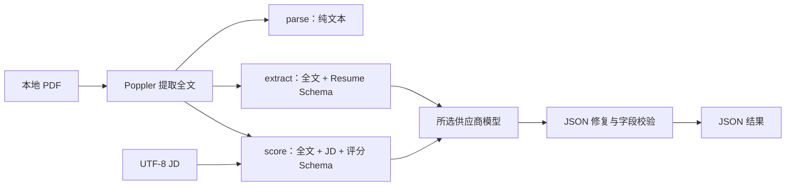

# resume-cli

用 Go 编写的 PDF 简历解析与岗位匹配工具。支持本地提取 PDF 文本、用 AI 整理简历信息，以及结合岗位描述生成匹配评分、评语和面试问题。可以不配置 API key，从二进制导出内置样例后离线演示。

## AI 辅助开发说明

本项目的代码实现与测试编写由 **GPT-6 Astra** 完成。我负责需求理解、技术选型和方案取舍，并通过实际试用、审阅输出和提出修改意见推动迭代。下文记录了我的设计思路、验证结果与已知限制，包括尝试后放弃的 Jev 组合方案。

## 需求理解与实现范围

我将任务拆成三个可独立运行的命令：

| 命令 | 输入 | 输出 | 是否调用 AI |
| --- | --- | --- | --- |
| `parse` | 本地 PDF 简历 | 提取的纯文本 | 否 |
| `extract` | 本地 PDF 简历 | 姓名、联系方式、城市、教育经历、技能 JSON | 是；mock 除外 |
| `score` | 本地 PDF 简历 + UTF-8 JD 文本 | 四项匹配分数、评语、面试问题 JSON | 是；mock 除外 |

实现范围还包括文件输出、无 key 演示、常见 JSON 格式修复、日志、Makefile/Dockerfile、输入异常处理和离线测试。工具关注单份简历的处理闭环，不包含招聘管理系统、数据库或 Web 服务。

评分用于辅助人工阅读：它是模型对“简历所述经历与岗位要求”的评价，不是对候选人真实能力的客观测量。缺少描述不等于缺少能力；JSON 校验通过也不意味着内容完全准确。

## 安装与离线演示

### 已拿到二进制

使用与你的操作系统、CPU 架构匹配的 `resume-cli`，不需要安装 Go 或下载源码。**运行 PDF 命令仍需安装 Poppler**：macOS 执行 `brew install poppler`；Debian/Ubuntu 执行 `sudo apt-get install poppler-utils poppler-data`。也可使用下文自带 Poppler 的 Docker 镜像。

中英文合成 PDF 和 JD 已通过 Go `embed` 编入二进制。即使当前目录没有源码或 `testdata`，也可以导出：

```sh
# 二进制放在当前目录时；如果已加入 PATH，可以省略 ./
./resume-cli samples demo-inputs
./resume-cli parse demo-inputs/resume-zh.pdf
./resume-cli extract demo-inputs/resume-zh.pdf --mock
./resume-cli score demo-inputs/resume-zh.pdf --jd demo-inputs/jd.txt --mock
```

`samples <新目录>` 不需要网络、key 或 Poppler，导出 `resume-zh.pdf`、`resume-en.pdf`、`jd.txt`、`jd-en.txt`。目标目录必须不存在，父目录必须存在；即使加 `--force` 也不会覆盖已有目录。

### 从源码构建

构建需要 **Go 1.25.5 或更新的兼容版本**，运行 PDF 命令需要 Poppler。在仓库根目录执行：

```sh
# macOS；Linux 的 Go 请另行安装对应版本
brew install go poppler
make build
./bin/resume-cli --help
make demo
```

`make build` 读取仓库中的 Makefile，生成本机使用的 `bin/resume-cli`；`make demo` 构建后用仓库里的样例演示三个命令。首次构建可能下载 Go 模块，演示不访问 AI API。

### mock 的用途与机制

`--mock` 用固定的内存实现替换真实 AI 适配器，供没有 key 的使用者演示，也便于离线回归。PDF 读取与 Poppler 解析、输入检查、JSON 输出和文件保存仍走正常流程；模型提取和评分返回预先定义的合成结果。

它仅接受上述合成简历和对应 JD，通过样例标记识别输入，不会分析任意真实简历；修改样例不会让固定评分自动变化。score 的 JSON 含 `mock: true`；extract 保持规定字段结构，mock 提示写入 stderr。它能演示程序流程，不能证明模型提取或评分质量。

## 配置真实模型

复制配置模板，填写一个供应商的 key，然后加载配置：

```sh
cp -n .env.example .env
chmod 600 .env
# 编辑 .env，填入所选供应商的 key，再加载自己创建的文件
set -a
. ./.env
set +a

./bin/resume-cli extract resume.pdf --output resume.json
./bin/resume-cli score resume.pdf --jd jd.txt --output result.json --stats usage.json
```

程序**不会自动读取 `.env`**。也可以通过 shell、容器或其他运行环境注入变量。命令行参数覆盖对应环境变量；已配置 provider/model 时无需重复传参。

| 环境变量 | 说明 |
| --- | --- |
| `RESUME_AI_PROVIDER` | `deepseek` / `gemini` / `kimi` / `openai` / `anthropic`，`claude` 是 anthropic 别名 |
| `RESUME_AI_API_KEY` | 所选供应商的 API key；更换供应商时同步更换，只通过环境变量传入 |
| `RESUME_AI_MODEL` | 可选，覆盖该供应商的预设模型 |
| `RESUME_AI_BASE_URL` | 可选，自定义 HTTPS API 地址；通常无需配置 |
| `RESUME_CLI_LANG` | 可选，`zh` / `en`，覆盖帮助与常见输入错误的语言 |
| `RESUME_LOG_LEVEL` | `debug` / `info` / `warn` / `error`，默认 `info` |

以下为**代码中的模型预设与验证状态**，不是对厂商全部型号的兼容性承诺：

| provider | 预设模型 | 接口 | 验证状态 |
| --- | --- | --- | --- |
| `deepseek` | `deepseek-flash` | Chat Completions | 有真实调用记录及离线协议测试 |
| `gemini` | `gemini-3.8-flash` | Interactions | 有真实调用记录及离线协议测试 |
| `kimi` | `kimi-k3` | Chat Completions | 真实调用使用 Kimi Code 的 `k3`；另有离线协议测试 |
| `openai` | `gpt-6-astra` | Chat Completions + 严格 JSON Schema | 离线协议测试；未用真实 key 验证 |
| `anthropic` / `claude` | `claude-sonnet-5` | 原生 Messages + 结构化输出 | 离线协议测试；未用真实 key 验证 |

选择的型号必须支持适配器所用接口。Kimi Code 订阅与开放平台的 key、端点和模型名不同；使用 Code 订阅时：

```sh
# RESUME_AI_API_KEY 已设为对应的 Kimi Code key
./bin/resume-cli score resume.pdf --jd jd.txt --provider kimi \
  --model k3 --base-url https://api.kimi.com/coding/v1
```

## 命令与参数

```sh
# parse 输出纯文本，可保存为文本文件
./bin/resume-cli parse resume.pdf --output resume.txt

# extract 输出结构化信息
./bin/resume-cli extract resume.pdf --output extracted.json

# score 读取纯文本 JD；默认生成中文评语和问题
./bin/resume-cli score resume.pdf --jd jd.txt --output result.json

# 英文报告，并保存耗时、token 用量和估算费用
./bin/resume-cli score resume.pdf --jd jd.txt --lang en --stats usage.json
```

`--jd` 要求 UTF-8 纯文本，不接受 PDF；如 JD 原件为 PDF，可以先用 `parse` 导出文本并检查阅读顺序。stdout 只写结果，日志和错误写入 stderr；失败退出码为 1。

| 参数 | 作用 |
| --- | --- |
| `--jd <path>` | score 必填：岗位描述文本路径 |
| `--output <path>` | 保存结果；省略时输出到终端 |
| `--force` | 允许覆盖已有结果/统计文件，但不能覆盖输入或同一文件的别名 |
| `--mock` | 使用合成样例离线演示，无 API 请求 |
| `--lang zh\|en` | score 报告语言，默认中文；不改变界面语言 |
| `--provider` / `--model` / `--base-url` | 覆盖模型环境配置 |
| `--cache-dir <dir>` | 仅 extract：显式启用 24 小时私有缓存 |
| `--stats <path>` | 保存成功/失败调用的耗时、token、缓存命中与估算费用 |
| `--timeout <duration>` | 整个命令的时间预算，默认 `90s`，大于 0 且不超过 `10m` |
| `--max-pdf-mib` / `--max-text-kib` / `--max-jd-kib` | 调整资源上限，范围见下表 |

### 资源上限与参数校验

| 资源 | 默认值 | 参数允许范围（含端点） | 参数 |
| --- | --- | --- | --- |
| PDF 文件 | 32 MiB | 1–200 MiB | `--max-pdf-mib` |
| PDF 提取文本 | 64 KiB | 1–256 KiB | `--max-text-kib` |
| JD 文本 | 32 KiB | 1–128 KiB | `--max-jd-kib` |

```sh
# 例如带作品集的较大 PDF，可以按需要增大读取上限
./bin/resume-cli score resume.pdf --jd jd.txt \
  --max-pdf-mib 200 --max-text-kib 256 --max-jd-kib 128
```

三个参数只接受范围内的整数。**0、负数、小数、非法文字、整数溢出以及超过最大值均会报错**，并指出对应参数。输入超过所设置的资源上限也会报错；不会截断、压缩或悄悄遗漏内容。

1 MiB = 1,048,576 字节，1 KiB = 1,024 字节。文本大小按 UTF-8 字节计算：64 KiB 约容纳 2.18 万个常见汉字，32 KiB 约 1.09 万个。PDF 图片体积与提取文本体积分别限制，避免含图片的文件仅因体积较大就无法处理。

默认值与最大值是本项目的本地资源保护策略，不是模型官方上下文上限。字节数不等于 token 数；调大参数不会扩大模型上下文，仍需为提示词和输出留空间。模型上下文不足时可能拒绝请求；本工具尚未实现各型号的精确 token 预算预检。

### 界面语言与报告语言

帮助与常见输入错误按 `RESUME_CLI_LANG` → `LC_ALL` → `LC_MESSAGES` → `LANG` 的优先级取首个非空值。**没有显式指定 `RESUME_CLI_LANG` 时，使用当前 terminal 终端通过 locale 环境变量提供的语言。**终端也未提供这些变量时回退英文。中文 locale（如 `zh_CN.UTF-8`、`zh_TW`）使用中文；其他、C/POSIX 或未设置时使用英文。无需分别编译。技术诊断与日志保持英文。

```sh
RESUME_CLI_LANG=en ./bin/resume-cli --help
RESUME_CLI_LANG=zh ./bin/resume-cli --help
# 英文界面仍可生成中文报告；中文界面也可生成英文报告
RESUME_CLI_LANG=zh ./bin/resume-cli score resume.pdf --jd jd.txt --lang en
```

报告始终独立默认中文，只由 `--lang en` 切换；JSON 字段名固定英文，extract 中的人名等事实保留来源语言。

## 示例输入与输出

仓库提供 [中文 PDF](testdata/resume-zh.pdf)、[英文 PDF](testdata/resume-en.pdf) 和 [示例 JD](testdata/jd.txt)。人物、联系方式和学校均为合成数据。

`extract testdata/resume-zh.pdf --mock`：

```json
{
  "name": "林予安",
  "phone": "",
  "email": "lin.yuan@example.com",
  "city": "杭州",
  "education": [
    {
      "school": "示例大学",
      "major": "软件工程",
      "degree": "本科",
      "graduation_time": "2022"
    }
  ],
  "skills": [
    "Go",
    "PostgreSQL",
    "Kubernetes"
  ]
}
```

缺失字符串使用 `""`，缺失集合使用 `[]`。技能从完整简历的实际工作、项目和技能描述中整理，不只读取“技能”栏目。

`score testdata/resume-zh.pdf --jd testdata/jd.txt --mock`：

```json
{
  "overall_score": 83,
  "skill_score": 100,
  "experience_score": 50,
  "education_score": 100,
  "comment": "合成演示：Go/PostgreSQL 开发及本科学历符合要求，Kubernetes 独立生产运维经验需要进一步确认。",
  "interview_questions": [
    "请介绍你在 Kubernetes 部署和生产运维中实际承担的职责。"
  ],
  "policy_version": "model-assessment-v1",
  "language": "zh",
  "mock": true
}
```

这是固定演示结果，不代表模型的实际准确率。真实报告保留相同结构，`mock` 为 false；四项分数均为 0–100 整数。完整样例见 [中文提取](examples/extract-zh.mock.json)、[中文评分](examples/score-zh.mock.json)、[英文评分](examples/score-en.mock.json)。

## 设计思路与技术选型

### 本地解析，两个独立 AI 任务



- **保留完整上下文。** `score` 直接使用完整简历文本和完整 JD，不依赖 `extract`。公开提取字段没有完整工作经历，若用它代替原文评分，会丢失职责和项目信息。两个任务共用模型接口、JSON 校验、HTTP 与统计逻辑。
- **单模型完成一次任务。** 正常情况下 extract 或 score 各进行一次生成；不串联多个模型或要求生成额外的证据目录。这样减少中间结构失败、延迟与调用成本。并不保证每次只产生一个 HTTP 请求，失败恢复策略见下文。
- **评分与代码校验分工。** 模型根据岗位重点给出分数、理由和问题，代码不套固定加权公式。`policy_version=model-assessment-v1` 标识当前输出策略。代码检查结构和范围，不用技能名称是否逐字出现来代替语义判断。
- **提示词限制推断。** 区分任职要求与优先条件、合并重复条件、区分“未体现”与“不具备”，不凭总工龄推断某项技术的使用年限。简历/JD 作为待分析数据，不应覆盖任务指令；这类提示约束仍需内容复核。

| 技术 | 选择理由与取舍 |
| --- | --- |
| Go | 标准库提供文件、JSON、HTTP、超时取消和测试支持；编译为单个 CLI 二进制 |
| Cobra | 复用命令与参数解析；定制帮助和常见错误，保持终端使用清楚 |
| Poppler | 在本地处理 PDF 字体与文本提取，避免自行实现 PDF 解析；代价是需要外部依赖，且不含 OCR |
| 原生 HTTP 适配器 | 用小接口隔离厂商差异；无大型 Agent 框架或数据库依赖，便于离线测试 |
| JSON Schema + 本地校验 | 尽早约束输出格式并检查字段；不能替代语义正确性验证 |

### 尝试过的方案：通用模型 + Jev

Jev 是 TypeSafe 的 System One 模型，面向有明确返回类型的局部语义判断。我曾考虑用通用模型从简历和 JD 整理事实、要求，再让 Jev 判断匹配关系，由代码汇总评分，以减少长文本生成的开销并控制评分过程。

两种类型与简历评估有关：

- **[Score](https://docs.typesafe.ai/primitives/score)**：在有顺序、有描述的等级之间判断，例如“未体现 → 基础了解 → 项目实践 → 独立生产负责”，返回等级概率和相应数值。它可用于单项能力匹配，但不是天然的招聘百分制，需要另行定义等级和换算规则。
- **[Choice](https://docs.typesafe.ai/primitives/choice)**：从指定选项中判断，例如“满足 / 部分满足 / 不满足 / 未知”，或选择支持结论的事实。选项和候选证据由程序提供，无法弥补上游遗漏。

Score 是设计时考虑的方向；实际保留评测记录的组合原型使用 **Choice 判断匹配状态及证据，再由代码映射分数并聚合**，并非直接用 Jev Score 输出最终分数。概率或置信度也不能当作结论正确的保证。

我最终选择单模型，原因是：

1. **配置更复杂。** 使用者除了通用模型，还要配置 Jev 的 key；开发侧也多了一套适配器、中间结构和失败处理。
2. **成本和速度没有形成足够的整体优势。** 加上事实提取、Jev 判断及报告生成后，未体现出值得增加一套依赖的稳定收益；DeepSeek、Gemini Flash 已能完成较低成本的单模型任务。
3. **最终评分在测试中不够合理。** 事实提取遗漏、匹配状态与所选证据不一致，以及固定分值/权重，都会影响最终结果。结构合规不等于评分合理，继续修补中间约束还会增加复杂度。

早期短合成集曾出现组合方案估算费用更低、规则通过率更高的结果，但那时单模型使用了更复杂的输出结构，不能直接与现在的全文输入、简洁报告比较。以上是我针对本任务端到端方案的取舍，不是对 Jev 所有用途的结论。历史数据见[单模型与组合方案评测](docs/evaluation-single-vs-hybrid-2026-09-20.md)；当前代码已移除 Jev 运行路径，不需要它的配置。

### 错误恢复与文件安全

- 模型 JSON 只自动修复 BOM、完整代码围栏和字符串外的尾逗号。拒绝缺项、null、重复键、未知字段和错误字段类型；评分另校验分数范围、非空评语和面试问题。
- 无效输出最多让模型根据原始输入和校验原因纠正一次。不会把损坏的响应直接当指令；若纠正请求失败，保留初次校验原因。
- HTTP 对指定的限流/临时服务错误有限重试，最多 3 次尝试；不重试 401 或不明网络故障。命令有统一超时，取消传播到本地解析和网络请求。每次已观察的调用都计入统计。
- 本地输入先验证再调用 AI；错误解释文件不存在、无权限、空文件、非 PDF、损坏/加密、无可提取文字、编码错误和超限。常见文件错误不直接暴露 OS 操作或临时文件路径。
- 输出采用完整文件提交，默认不覆盖已有文件，禁止覆盖输入及其别名；创建的结果/缓存文件使用 0600 权限。日志不输出 key、完整简历或模型原始响应。
- extract 缓存默认关闭；启用后按输入文本哈希及 provider/model/endpoint 区分，24 小时有效。score 不使用提取缓存。

例如：

```text
resume-cli: 岗位描述（JD）："jd.none"：文件不存在，请检查路径和文件名。
resume-cli: --max-pdf-mib: 该参数必须是 1 到 200 之间的整数。
```

PDF 解析在本地进行；真实 extract/score 会把**提取出的简历文本与任务所需 JD**发送给所选供应商。原始 PDF 图片不会发送给模型进行视觉分析。API key、真实简历和评测中间结果应保存在 Git 忽略的本地目录中。

### 代码结构

```text
samples.go        将四份合成样例嵌入二进制
cmd/resume-cli/    程序入口、信号与退出码
internal/cli/     命令、配置、帮助、参数校验和依赖组装
internal/app/     Parse / Extract / Score 用例与小接口
internal/pdf/     有界 PDF 读取、Poppler 子进程与文本输出
internal/ai/      提示词、厂商适配器、HTTP、纠正重试与用量
internal/domain/  Document / Resume 与字段校验
internal/report/  评分与报告结构
internal/fileio/  有界输入、安全输出与文件错误
internal/jsonutil/ JSON 校验与有限格式修复
internal/cache/   可选的私有提取缓存
internal/i18n/    locale 检测、消息目录和错误展示
scripts/          合成数据生成与独立评测工具
```

详细实现见 [架构文档](docs/architecture.md) 和 [全文提取设计](docs/extraction-design.md)。

## 测试与调用成本

```sh
# 单元测试、race 检查和静态检查；不调用真实 AI
make check
python3 -m unittest discover -s scripts -p 'test_*.py'

# 仅打印评测计划，不读取 key，不调用模型
python3 scripts/evaluate.py
# 离线合成样例评测；输出目录必须不存在
python3 scripts/evaluate.py --routes mock --repeats 1 --execute --out .local/eval-demo
```

首次构建或测试时，Go 可能下载 `go.mod` 中的公开代码依赖，下载后会缓存在本机；这与调用 AI 是两回事。需要完全断网运行时，先在联网环境执行 `go mod download`，然后运行 `GOPROXY=off make check`（还需预先安装对应 Go 工具链和 Poppler）。

Go 测试使用内存 HTTP 替身，AI/CLI 测试默认禁止真实网络，不读取 `.env`。覆盖文件与大小边界、参数范围/溢出、PDF 进程失败、完整输入、JSON 修复、一次纠正、厂商协议、超时取消、缓存、输出防覆盖及中英文界面/报告的独立性。`make check` 包含单测、race 和 vet。

DeepSeek、Gemini、Kimi Code 有有限真实调用记录，OpenAI/Claude 仅做过离线协议验证。旧评测使用过不同 prompt 和评分结构，不能把它们混算成当前版本的准确率或速度保证。

`--stats` 的费用按供应商返回的 token 和代码中的费率估算；未知费用不当作零，Kimi Code 订阅不折算成按 token 美元账单。详见 [厂商与成本](docs/providers-and-cost.md)。真实评测需显式执行并配置对应 key，方法见 [评测协议](docs/evaluation.md)。

## Docker 使用方式

Dockerfile 是镜像构建说明，`make build` 不会构建镜像。安装并启动 Docker 后，在仓库根目录执行：

```sh
# 构建包含 CLI、Poppler、证书及合成样例的镜像
# 修改代码后需重新执行此命令
docker build -t resume-cli .

# 查看帮助；镜像 ENTRYPOINT 已是 resume-cli，后面直接写子命令
docker run --rm resume-cli --help

# 禁网演示，无需 API key，也无需在宿主机安装 Go 或 Poppler
docker run --rm --network none resume-cli score /examples/resume-zh.pdf \
  --jd /examples/jd.txt --mock
```

真实调用示例（macOS/Linux shell）：先把 `resume.pdf` 和 UTF-8 `jd.txt` 放进当前目录的 `input/`，在 `.env` 中填写 `RESUME_AI_PROVIDER`、`RESUME_AI_API_KEY` 等 `KEY=value` 配置，再执行：

```sh
docker run --rm --user "$(id -u):$(id -g)" \
  --env-file .env \
  -v "$PWD/input:/input:ro" \
  resume-cli score /input/resume.pdf --jd /input/jd.txt > result.json
```

`/input` 是容器里的只读路径；`> result.json` 由宿主机 shell 保存结果，日志仍显示在 stderr。重定向会覆盖宿主机同名文件，请使用新的结果文件名；若使用容器内的 `--output`，应另挂载可写输出目录，否则 `--rm` 会连同容器一起删除结果。`.env` 只在运行时通过 `--env-file` 传入，不打包进镜像。

镜像使用多阶段构建，默认以非 root 用户运行；真实输入示例用当前用户 UID/GID 读取其文件。构建需要访问基础镜像、系统包源和 Go 依赖源；真实 AI 调用需要网络，mock 运行可禁网。最新镜像的构建验证状态见[开发记录](docs/development.md)。

## 已知限制与后续工作

- 只提取 PDF 中已有的文本；不支持 OCR、作品图片的视觉理解或加密 PDF 解锁。复杂多栏、跨页页眉可能影响阅读顺序，建议先 `parse` 检查。
- 没有按模型精确计算上下文 token，也没有确定性的任职时间合并或技术使用年限推导。
- 提取可能遗漏或过度归纳；评分与评语有随机性，需人工检查。有限样本和结构校验不能证明招聘判断准确。
- 未验证 Windows、高并发批处理及 OpenAI/Claude 的真实调用。
- 实现包含全部三个命令、文件输出、mock、JSON 修复、日志、中英文、资源配置、测试与构建脚本；公开仓库发布、演示视频及外部提交尚未完成。

历史实验保留在 `docs/evaluation-*.md` 与 `examples/history/`，仅用于查阅设计演进，不作为当前用法。第三方信息见 [THIRD_PARTY_NOTICES.md](THIRD_PARTY_NOTICES.md)。
