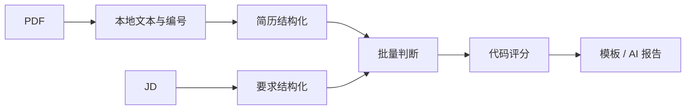

# resume-cli

Go PDF 简历分析 CLI：本地提取文本，整理带原文证据的简历和岗位要求，由 Jev 判断匹配情况，再由代码计算分数并生成报告。

**已实现三个命令及全部增强功能，并完成 Gemini / DeepSeek / Jev 真实 API 测试。最终 96 次合成评分均成功；提取仍有技能遗漏，不能将调用成功率视为准确率。详见 [实测报告](docs/evaluation-results-2026-09-20.md)。**

## 项目简介

| 命令 | 功能 | 模型调用 |
| --- | --- | --- |
| `parse <pdf>` | 提取本地 PDF 文本 | 无 |
| `extract <pdf>` | 姓名、联系方式、城市、教育、技能 | 生成模型 |
| `score <pdf> --jd <txt>` | 分数、证据、评论、面试问题 | 生成模型 + Jev |

简历和 JD 的整理阶段并行、可分别缓存。评分区分“未体现”与“明确不符”，来源证据随报告保留。

## 安装与快速开始

需要 Go 1.25.5 或更新版本，以及 Poppler：

```sh
# macOS
brew install poppler
# Debian / Ubuntu（中文字符映射也需要）
# sudo apt-get install poppler-utils poppler-data

go mod download
make build
bin/resume-cli parse testdata/resume-zh.pdf
bin/resume-cli extract testdata/resume-zh.pdf --mock
bin/resume-cli score testdata/resume-zh.pdf --jd testdata/jd.txt --mock
bin/resume-cli score testdata/resume-en.pdf --jd testdata/jd-en.txt --mock --lang en
```

`--mock` 不需要密钥，没有模型请求；仍真实读取 PDF/JD、校验和评分。仅支持仓库中带演示标记的中英文样例，拒绝对任意简历返回固定的虚假分析。

容器包含 Poppler、中文字符映射及合成样例，以非 root 用户运行：

```sh
docker build -t resume-cli:local .
docker run --rm --network none resume-cli:local parse /examples/resume-zh.pdf
docker run --rm --network none resume-cli:local extract /examples/resume-en.pdf --mock
docker run --rm --network none resume-cli:local score /examples/resume-zh.pdf \
  --jd /examples/jd.txt --mock
# 输入只读挂载，stdout 保存在宿主机
docker run --rm --network none -v "$PWD/testdata:/input:ro" resume-cli:local \
  score /input/resume-zh.pdf --jd /input/jd.txt --mock > result.json
```

真实模式需允许网络并用 `--env-file .env` 注入密钥。镜像及构建上下文不包含 `.env`、本地需求原文和真实简历。

## 技术选型

| 组件 | 选择及理由 |
| --- | --- |
| Go + Cobra | CLI 框架与用例逻辑分离，标准库负责 HTTP / JSON / slog |
| Poppler | 本地子进程解析，不上传 PDF 文件；是额外运行时依赖 |
| Gemini 3.8 Flash / DeepSeek V4.1 Flash | 简历与 JD 结构化；DeepSeek 实测更快、更便宜，Gemini 字段遗漏较少 |
| Jev | 一次批量 Choice 判断要求状态及对应证据 |
| OpenAI / Kimi | 从同一原始文本独立完成 AI 分析，共用代码评分政策 |
| 模板 / 可选 AI 报告 | 默认本地中英文模板，减少一次模型调用 |
| 文件缓存 | 显式开启、简历/JD 分开、24h TTL；不引入数据库 |
| Makefile + Dockerfile | 本地开发与带 PDF 依赖的交付环境 |



适配器隔离供应商请求、schema、思考参数和用量字段；HTTP、校验和日志复用。小接口围绕实际替换点，不引入 Agent 框架。见 [架构](docs/architecture.md) 与 [开发恢复入口](docs/development.md)。

## 环境变量配置方式

参考 [.env.example](.env.example)。CLI **不会自动加载 `.env`**，通过 shell、运行环境或 Docker 注入；密钥不放在命令行参数中。

| 变量 | 用途 / 默认值 |
| --- | --- |
| `RESUME_AI_PROVIDER` | `gemini` / `deepseek` / `openai` / `kimi`，无默认值 |
| `RESUME_AI_MODEL` | 可选模型覆盖；跨供应商切换时应取消该变量 |
| `GEMINI_API_KEY` / `DEEPSEEK_API_KEY` | 对应生成供应商 |
| `TYPESAFE_API_KEY` | 真实 hybrid 评分的 Jev 密钥 |
| `RESUME_JEV_MODEL` | 默认 `jev-1.13.0` |
| `OPENAI_API_KEY` / `KIMI_API_KEY` | 对应生成供应商 / 独立对照 |
| `RESUME_LOG_LEVEL` | debug / info / warn / error，默认 info |
| `RESUME_AI_BASE_URL` / `TYPESAFE_BASE_URL` | 可选 HTTPS API 地址，默认官方地址 |

模型预设为 `gemini-3.8-flash`、`deepseek-flash`、`gpt-6-astra`、`kimi-k3`。前三条已实测的 API 为 Gemini、DeepSeek 和 Jev；OpenAI/Kimi 适配器仅通过离线契约测试，尚缺 key 验证。parse / mock 不检查 key。

本次评分可优先试 `--provider deepseek`：48 次评分的中位耗时 2.59 秒，平均估算 $0.00062/份（含 Jev）；Gemini 为 3.77 秒、$0.00249/份。但两家都有技能数组遗漏，Gemini 1/48、DeepSeek 3/48，暂不设置全局默认供应商。`.env.example` 的 DeepSeek 是便于试运行的示例选择。

```sh
# 已注入对应 key 后
bin/resume-cli extract resume.pdf --provider deepseek
bin/resume-cli score resume.pdf --jd jd.txt --provider deepseek --output result.json
bin/resume-cli score resume.pdf --jd jd.txt --provider gemini --lang en --report ai
# 独立完整 AI 对照，不需要 Jev key，也不读取 Jev 答案
bin/resume-cli score resume.pdf --jd jd.txt --provider openai --pipeline baseline
bin/resume-cli score resume.pdf --jd jd.txt --provider kimi --pipeline baseline
```

## CLI 命令说明

三个命令支持 `--help`。结果写 stdout，日志和错误写 stderr；成功退出码 0，失败为非 0。

| 参数 | 行为 |
| --- | --- |
| `--output <path>` | 保存文本或 JSON，不重复写 stdout |
| `--force` | 允许替换已有输出，禁止覆盖输入或其别名 |
| `--mock` | 合成演示；不能与 baseline / AI 报告组合 |
| `--lang zh\|en` | 默认 zh；只控制评论和问题，事实、引用不翻译 |
| `--provider` / `--model` | 覆盖相应环境变量 |
| `--pipeline hybrid\|baseline` | score 路径，默认 hybrid |
| `--report template\|ai` | hybrid 报告，默认 template；baseline 自带报告 |
| `--cache-dir <dir>` | 显式启用结构化缓存，默认关闭 |
| `--stats <path>` | 保存成功或失败的耗时、调用、用量、缓存命中 |
| `--timeout <duration>` | 默认 90s，大于 0 且不超过 10m |

输出与 stats 路径须不同，默认不覆盖已有文件；新文件权限 0600，父目录须已存在。参数、已有输出和日志配置等前置校验失败不生成 stats。字段名固定英文 snake_case，缺失事实为 `""` / `[]`。

语言不改变评分政策；两次真实调用可能因模型随机性而有差异，重新请求不保证同一分数。

## 示例输入和输出

合成样例覆盖中文、英文、多栏、空文本和多段教育/重叠任期。演示人物为“林予安 / Lin Yuan”，包含 Go/PostgreSQL 开发、Kubernetes 部署、本科，以及未承担生产故障处理的说明。

实际生成的离线结果：[中文 extract](examples/extract-zh.mock.json)、[中文 score](examples/score-zh.mock.json)、[英文 score](examples/score-en.mock.json)。演示评分主字段如下：

```json
{
  "overall_score": 83,
  "skill_score": 100,
  "experience_score": 50,
  "education_score": 100
}
```

真实合成样例：[DeepSeek 中文 extract](examples/extract-zh.deepseek.json)、[DeepSeek + Jev 中文 score](examples/score-zh.deepseek-jev.json)、[Gemini + Jev 英文 score](examples/score-en.gemini-jev.json)。真实评分样例为 65 分，生产运维项按明确否定记 0；mock 中的部分匹配是固定演示，不作为模型真值。

完整结果还有 comment、interview_questions、逐条 findings 与证据、not_required、policy_version、language、mock。**上面的 83 分片段是 mock 结果，不是模型质量实测。**

## 评分与可靠性

策略 `evidence-v1`：满足 100、部分满足 50、明确不符 0、未体现 0。后两类报告分开表达，confidence 不转换为候选人能力分。技能/经历/教育权重 50%/35%/15%，同维度必需项权重 2、优先项 1。

- 未要求的维度不计总分；为兼容固定结构保留数字 100，并在 not_required 中标明，不能解释成能力满分。
- 事实与引用须能在来源中找到；证据恢复为完整来源行以保留否定和责任边界，遗漏的已提取技能/教育证据可从原文补齐。该步骤不会自动补齐遗漏的公开字段。
- 空证据集合拒绝评分；Jev 判断与所选证据冲突时，改为未体现、0 分并显示需复核标记，不能静默给分。原文存在某句话，并不等于它属于有效履历事实。
- JSON 修复：完整代码围栏、BOM、字符串外的尾逗号。拒绝重复键、未知/缺失字段、null、错误类型、超深 JSON、截断和拼接结果，不补造内容。
- 调用可取消、有超时；仅 429/529/502/503/504 有界重试，最多 3 次。鉴权不重试；JSON/schema 或 Candidate/Job 来源校验失败时，任务层最多从原始输入重新生成一次，单独记录成本。禁用 HTTP 重定向。
- stats 保存已知用量；Gemini 可计费思考 token 计入输出。费用未知不假称零，重试造成费用不完整时 cost_complete=false。
- 估算价格日期 2026-09-20，不是账单；DeepSeek 使用保守高峰价、Kimi 使用国际美元价，自定义模型/端点需另行核对。
- 缓存含证据，默认关闭；文件 0600、新目录 0700、24h TTL，只存成功结构化数据，评分和报告每次重算。

上限：PDF 20 MiB、提取文本 160 KiB、JD 64 KiB、模型响应 2 MiB、64 条事实、24 条要求。Jev 另设保守上下文字节限制，超限报错而非截断。不含 OCR；复杂版式阅读顺序不保证完全正确。

## 测试与模型评测

先下载构建依赖，测试使用 `GOPROXY=off`。HTTP 测试用内存替身，不发送实际请求，也不启动 localhost 服务；PDF 用例只运行本地 Poppler，缺少依赖时明确跳过。

```sh
make test
make race
make vet
# 或一次运行以上三项
make check
```

2026-09-20：全部 Go 测试、竞态检查及 vet 通过。总体语句覆盖率 **87.5%**，领域规则 **96.1%**，AI 适配器 **90.5%**。Docker 禁网验证三个命令通过。覆盖率不代表真实模型正确率。

JSON 修复器另外运行约 10 秒 fuzz，执行 478,049 次输入，无失败。

```sh
# 默认仅列计划，不调用模型
python3 scripts/evaluate.py
# 只检查离线评测链路
python3 scripts/evaluate.py --routes mock --repeats 1 --execute --out .local/eval-smoke-new
# 有 key 后做小规模真实冒烟
python3 scripts/evaluate.py --routes gemini deepseek --limit 2 --repeats 1 \
  --execute --out .local/eval-api-smoke
# 四条路径，各样例三次，打乱顺序
python3 scripts/evaluate.py --execute --out .local/eval-full
```

12 个开发案例和 4 个补充回归案例；后者曾用于发现问题并调整提示词，最终已不算独立保留集。保存每次结果、stats、错误日志、检查表和汇总。统计包含失败，质量按原文检查，不能仅依赖脚本。Gemini / DeepSeek 比较质量与速度，接近时优先便宜的 DeepSeek；OpenAI / Kimi 为独立完整对照。见 [评测协议](docs/evaluation.md)。

## 已实现功能

- 三个命令，默认中文和英文切换。
- 五项增强：文件输出、mock、JSON 修复、日志、Makefile / Dockerfile。
- 证据校验、确定性评分、可选 AI 报告、独立基线。
- 缓存、取消与重试、用量及估算成本。
- 文件、JSON、HTTP、评分、取消、并发和命令端到端测试。

## 已知问题与未完成内容

- Gemini/DeepSeek/Jev 已实测，OpenAI/Kimi 缺 key，未实测；生成模型暂时仍需显式选择。
- 两家生成模型均出现公开 skills 数组为空但 facts 保留技能证据的情况；DeepSeek 另有两次要求分类差异。来源校验能拒绝虚构引用，无法证明提取完整。
- 合成集较小，尚无独立保留测试集，不能据此声称生产准确率。多栏 PDF 只有基础解析用例。
- 不做 OCR、加密文件解锁、数据库和批处理服务。
- 未实现精确任职区间合并与技能年限计算；提示词禁止重叠任期相加或把总工龄等同技能年限，本轮重叠任期样例未发生重复累加，但不代表任意履历均可靠。
- 未验证 Windows，尚未完成公开仓库与演示视频。

原题、会话、真实输入和评测中间数据位于 Git 忽略目录，公开例子均为合成数据。第三方说明见 [THIRD_PARTY_NOTICES.md](THIRD_PARTY_NOTICES.md)。
